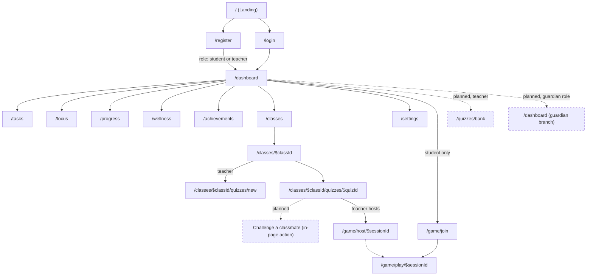

# Focus Flow: Information Architecture

*Every screen and every navigation path implied by [04_Product_Requirements_Document.md](04_Product_Requirements_Document.md). This document answers "what pages exist and how does someone get between them" — not what they look like ([11_UI_UX_Design_System.md]) and not what data they carry ([09_Database_Design.md]).*

Governed by [-01_Focus_Flow_Principles.md](-01_Focus_Flow_Principles.md). As with every prior document, each page is tagged **Built** or **Planned**.

---

## Routing conventions (binding, learned the hard way)

Two rules below are not stylistic preferences — they come directly from real bugs hit while building this product, and any new page must follow them:

1. **A route that will ever gain a child route must never be a bare leaf file.** A file like `classes.tsx` sitting alongside `classes.$classId.tsx` silently becomes an implicit parent layout requiring its own `<Outlet />` — the URL navigates correctly but the child never renders, with no error. Any route that might grow children starts as `name.index.tsx` + a real `name.tsx` layout from day one, not retrofitted later.
2. **Routes that share no real parent-child relationship stay flat, even if they feel related.** The three Live Game Session routes (`game.join`, `game.host.$sessionId`, `game.play.$sessionId`) deliberately do not nest under the quiz they belong to — nesting them would recreate rule 1's trap one level deeper, since the session ID alone is enough to resolve everything needed server-side.

Every authenticated page additionally shares one non-negotiable rule: a `beforeLoad` guard checks for a valid session and redirects to `/login` if none exists — enforced per-route, not assumed from a shared layout alone, since a shared assumption is exactly the kind of thing that silently breaks when a page is refactored.

---

## Sitemap

*Dashed edges/nodes are Planned; solid are Built.*

---

## Public pages (unauthenticated)

| Route | Status | Purpose | Access |
|---|---|---|---|
| `/` | Built | Landing page — pitch, "Get Started Free," "Log In." | Anyone |
| `/register` | Built | [A1](04_Product_Requirements_Document.md#a1-role-guided-registration) — 2-step wizard: role card, then details. | Anyone, redirects to `/dashboard` if already authenticated |
| `/login` | Built | [A2](04_Product_Requirements_Document.md#a2-login--session) — email/password. | Anyone, redirects to `/dashboard` if already authenticated |

---

## Authenticated shell

Every page below sits inside a persistent shell: a top nav (logo, avatar dropdown with Settings/Log out) and a role-appropriate sidebar built from a single shared nav-config, so Student and Teacher never see two independently-maintained link lists that can drift apart.

| Route | Status | Purpose | Access | Notes |
|---|---|---|---|---|
| `/dashboard` | Built | Role-branched landing: Teacher sees class/student/quiz counts + recent attempts; Student sees focus-sessions-today/classes/achievements. | Student, Teacher | Planned: a third branch for Guardian (A3), reusing this route rather than a new one, matching the existing role-branch pattern. |
| `/tasks` | Built | [C1](04_Product_Requirements_Document.md#c1-personal-task-management) personal tasks; planned grouping into Personal / Assigned (Practice / Quiz) once [C2](04_Product_Requirements_Document.md#c2-practice-task-assignment) ships. | Student, Teacher (both use personal tasks) | |
| `/focus` | Built | [D1](04_Product_Requirements_Document.md#d1-focus-session) timer + [D2](04_Product_Requirements_Document.md#d2-focus-mode--distraction-detection) Focus Mode. | Student, Teacher | Planned: [D3](04_Product_Requirements_Document.md#d3-commitment-setting) Commitment prompt added here, not a new route. |
| `/progress` | Built | Streaks, weekly focus minutes, 14-day chart (student-shaped today). | Student, Teacher | Planned: teacher role-branch adds [H2](04_Product_Requirements_Document.md#h2-class-trend-analytics) class trend view — extends this route, does not fork into a new one. |
| `/wellness` | Built | [G1](04_Product_Requirements_Document.md#g1-wellness-check-in--reflection) mood check-in, tips, breathing exercise. | Student, Teacher | |
| `/achievements` | Built | [E3](04_Product_Requirements_Document.md#e3-achievements--badges) badge grid. | Student, Teacher | |
| `/settings` | Built | Profile + password update. | Student, Teacher | |

---

## Classroom pages

| Route | Status | Purpose | Access | Notes |
|---|---|---|---|---|
| `/classes` (`classes.index.tsx`) | Built | [B2](04_Product_Requirements_Document.md#b2-class-creation)/[B3](04_Product_Requirements_Document.md#b3-class-joining) — create (teacher) or join (student) dialog; class cards with curriculum/subject badges. | Student, Teacher | Named `.index.tsx`, not a bare `classes.tsx` — see Routing Conventions rule 1. |
| `/classes/$classId` (`classes.$classId.tsx`) | Built | Layout only — auth guard + `<Outlet />`, no content of its own. | Student, Teacher (enrolled/owning only, enforced server-side) | |
| `/classes/$classId` (`classes.$classId.index.tsx`) | Built | [B4](04_Product_Requirements_Document.md#b4-roster--enrollment-management) roster (teacher, with per-student remove) or class info (student); quiz list; **"Practice Tasks" panel** (Sprint 1, [C2](04_Product_Requirements_Document.md#c2-practice-task-assignment)) — extends this page, no new route. | Student, Teacher | |
| `/classes/$classId/quizzes/new` | Built | [C3](04_Product_Requirements_Document.md#c3-quiz-authoring) quiz creation form. | Teacher (owner only) | |
| `/classes/$classId/quizzes/$quizId` | Built | Role-split: authoring + results (teacher) or take-quiz flow (student). | Student, Teacher | Planned: an in-page "Challenge a classmate" action once [F2](04_Product_Requirements_Document.md#f2-async-challenge-mode) ships — stays inside this page rather than becoming a new route, since a challenge is just a second Quiz Attempt on the same quiz. |

---

## Live play pages

Deliberately flat (see Routing Conventions rule 2) — none of these nest under the quiz or class they belong to.

| Route | Status | Purpose | Access |
|---|---|---|---|
| `/game/join` | Built | [F1](04_Product_Requirements_Document.md#f1-live-game-session) — enter a Game PIN. | Student |
| `/game/host/$sessionId` | Built | Host controls: start, advance phase, live leaderboard. | Teacher (session owner only) |
| `/game/play/$sessionId` | Built | Player view: question, countdown, answer submission, reveal. | Student (participant only) |

---

## Planned pages

| Route | Status | Purpose | Access | Why this shape |
|---|---|---|---|---|
| `/quizzes/bank` | Planned | [F3](04_Product_Requirements_Document.md#f3-public-quiz-bank) — browse/filter by curriculum + subject, copy into own class. | Teacher only | A new top-level route, not nested under `/classes`, because a bank listing is cross-class by definition and copying targets a class chosen *during* the copy action, not before. |
| `/dashboard` (guardian branch) | Planned | [A3](04_Product_Requirements_Document.md#a3-guardian-invitation--access) weekly effort/mood trend for invited students. | Guardian | Reuses the existing role-branch pattern on `/dashboard` rather than a new route — consistent with how Teacher/Student already share this URL. |

---

## Navigation rules

- **Nav links come from one shared source** (`nav-config.ts`), consumed identically by the desktop sidebar and the mobile menu — the two must never diverge, since they drifted apart once already during earlier development and the fix was exactly this consolidation.
- **A role never sees a nav entry it has no access to** — not shown-but-disabled, not a "Soon" badge, absent entirely, except during genuine incremental rollout of a Planned feature (in which case the entry is omitted until the feature actually ships, not stubbed in early).
- **A student never sees another student's data through navigation alone** — every link's destination re-verifies access server-side regardless of how the link was reached (a correct-looking URL typed directly must be exactly as safe as a clicked link).

---

**Next:** [06_User_Roles_And_Permissions.md] — the exact Can View / Can Create / Can Update / Can Delete / Can Share / Can Moderate matrix for every role against every object named in [03_Product_Glossary.md](03_Product_Glossary.md).
