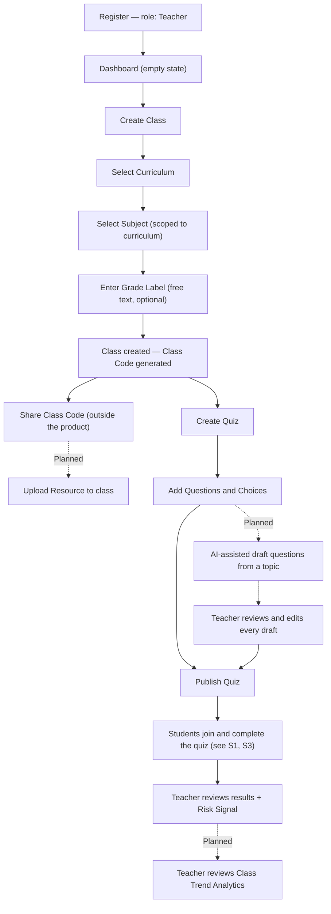
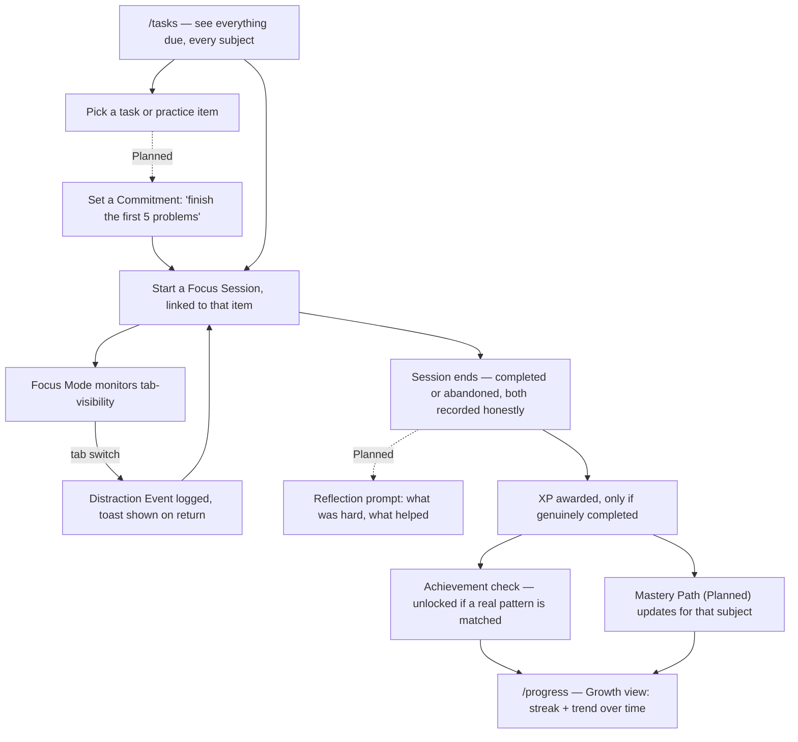

# Focus Flow: User Journeys

*Every workflow named in [04_Product_Requirements_Document.md](04_Product_Requirements_Document.md), walked step by step, using the exact pages from [05_Information_Architecture.md](05_Information_Architecture.md) and respecting exactly the permissions in [06_User_Roles_And_Permissions.md](06_User_Roles_And_Permissions.md).*

Governed by [-01_Focus_Flow_Principles.md](-01_Focus_Flow_Principles.md). Each step is tagged inline where it isn't obviously **Built** — `(Planned)` marks a step that doesn't exist yet. One correction from the founder's own original example is carried through every journey below rather than repeated as a caveat each time: there is no "Select Stream" step, because Stream is not a Focus Flow object today (see [03_Product_Glossary.md](03_Product_Glossary.md)) — class setup goes Curriculum → Subject → free-text Grade Label instead.

---

## Teacher journeys

### T1. Onboarding to First Published Quiz — the flagship journey



**Notes:** Step F replaces the founder's original "Select Grade → Select Stream" with what the product actually supports — see the correction above. Step L is bound by a non-negotiable rule from [02_Product_Definition.md](02_Product_Definition.md): an AI-drafted question is never usable until a teacher has explicitly reviewed it (step M); there is no path from L directly to N.

Exercises: [B2](04_Product_Requirements_Document.md#b2-class-creation), [C3](04_Product_Requirements_Document.md#c3-quiz-authoring), [D4](04_Product_Requirements_Document.md#d4-teacher-risk-signal).

---

### T2. Assign and Monitor a Practice Task *(Planned)*

```
Class Detail
↓
"Manage Practice Tasks" panel
↓
Create Practice Task (title, description, due date)
↓
System fans out one task per actively-enrolled student
↓
Teacher waits (no action required)
↓
Dashboard shows aggregate completion count ("18 of 24 done")
↓
Teacher opens Risk Signal for the class
↓
Sees which specific students have zero focus time logged and no completion, past 48 hours
↓
Teacher sends a private, supportively-worded nudge (channel TBD — see 15_Security_Privacy.md for how a nudge is delivered)
```

Exercises: [C2](04_Product_Requirements_Document.md#c2-practice-task-assignment), [D4](04_Product_Requirements_Document.md#d4-teacher-risk-signal). The nudge itself has no confirmed delivery mechanism yet — treat as an open question for the PRD's next revision, not a decided feature.

---

### T3. Host a Live Game Session

```
Class Detail → Quiz Detail
↓
"Host Live Game" (works even if the quiz is still in draft — the PIN is its own access gate)
↓
Game PIN generated
↓
Students join via /game/join (see S4)
↓
Teacher starts the session from /game/host/$sessionId
↓
Teacher advances each question phase (question → reveal → next)
↓
Live leaderboard updates after every reveal
↓
Final phase: podium / final standings
↓
Teacher returns to Quiz Detail — per-student results now include this session's answers
```

Exercises: [F1](04_Product_Requirements_Document.md#f1-live-game-session). Scoring is always server-computed from the server's own clock — nothing in this journey depends on trusting a student's device to report its own speed or correctness.

---

### T4. Publish to and Reuse from the Public Quiz Bank *(Planned)*

```
Quiz Detail (an existing, owned quiz)
↓
"Publish to Public Bank"
↓
Quiz now discoverable by curriculum + subject to other teachers (never to students)
↓
— separately, another teacher —
↓
/quizzes/bank
↓
Filter by Curriculum + Subject
↓
Preview a listing (no answer key visible before copying)
↓
"Copy into my class" → choose target class
↓
A new, fully independent Quiz is created in that teacher's own class
↓
Copying teacher edits their copy freely — the original is never affected
```

Exercises: [F3](04_Product_Requirements_Document.md#f3-public-quiz-bank). Moderation of bank content belongs to Platform Administrator, not to any teacher in this journey — see [06_User_Roles_And_Permissions.md](06_User_Roles_And_Permissions.md).

---

### T5. Weekly Review & Intervention Loop

```
Dashboard
↓
Recent Quiz Attempts (built) + Class Trend Analytics (Planned)
↓
Notice a downward trend in focus-minutes or completion rate for one class
↓
Open that class's Risk Signal
↓
Identify specific at-risk students (not just a class-wide number)
↓
Adjust next week's Practice Task assignment (Planned) toward the flagged topic
↓
Following week: compare the same trend, confirm whether the adjustment helped
```

This is the loop that answers the founding brief's "analytics that show trends, not just scores" — it only works once [H2](04_Product_Requirements_Document.md#h2-class-trend-analytics) ships; today, step 2's trend half does not exist yet.

---

## Student journeys

### S1. Onboarding to First Joined Class

```
Register — role: Student (Grade field appears; it never would have for a Teacher)
↓
Dashboard (empty state — no classes yet)
↓
Classes → "Join Class"
↓
Enter 6-character Class Code
↓
Enrollment created
↓
Class appears immediately, with curriculum/subject badges
↓
Any due-dated, published Quiz for that class appears in /tasks automatically (C5)
```

Exercises: [B3](04_Product_Requirements_Document.md#b3-class-joining), [C5](04_Product_Requirements_Document.md#c5-quiz-linked-task-auto-creation).

---

### S2. The Daily Focus Loop — the core habit journey

This is [02_Product_Definition.md](02_Product_Definition.md)'s seven-stage Planning → Growth cycle, made concrete:



**Notes:** F looping back to D (not forward) is deliberate — a distraction doesn't end the session, it's logged and the student keeps going, matching the honest-abandonment rule in [D1](04_Product_Requirements_Document.md#d1-focus-session). Step G's honest recording (even on abandonment) means step I is the only gate on XP — an abandoned session never reaches I.

---

### S3. Completing a Teacher-Assigned Quiz (asynchronous)

```
/tasks — a quiz-linked task is due soon
↓
Open the linked Quiz
↓
Start Attempt
↓
Answer each question (no correctness shown yet)
↓
Submit
↓
Score computed server-side, immediately
↓
Correctness now visible per choice, for this attempt only
↓
[Planned] Challenge a classmate to beat this score
```

Exercises: [C4](04_Product_Requirements_Document.md#c4-quiz-taking--grading), [F2](04_Product_Requirements_Document.md#f2-async-challenge-mode).

---

### S4. Joining a Live Game Session

```
/game/join
↓
Enter Game PIN
↓
Enter nickname (first name + last-initial, per existing convention)
↓
Wait in lobby for the teacher to start
↓
Answer each question within its time limit
↓
See own result + live leaderboard after each reveal
↓
Final standings at the end
```

Exercises: [F1](04_Product_Requirements_Document.md#f1-live-game-session).

---

### S5. Async Challenge *(Planned)*

```
Just finished a Quiz Attempt
↓
"Challenge a classmate"
↓
Pick a classmate (or leave it open)
↓
Challenged student sees it in their own task list, on their own time
↓
Challenged student plays the same quiz as a normal Quiz Attempt
↓
Once both scores exist, a comparison is shown to both
↓
Neither side sees the other's specific wrong answers — only the score
```

Exercises: [F2](04_Product_Requirements_Document.md#f2-async-challenge-mode).

---

## Guardian journey *(Planned)*

### GD1. Invited by a Student → Weekly Trend View

```
Student: Settings (or Dashboard) → "Invite a Guardian"
↓
Guardian receives an invite (channel TBD)
↓
Guardian registers/logs in
↓
Guardian Dashboard: weekly effort + mood trend, for this student only
↓
No grades, no quiz content, no raw timestamps, no journal notes — ever
↓
Student can revoke access at any time; effective immediately
```

Exercises: [A3](04_Product_Requirements_Document.md#a3-guardian-invitation--access). The invite delivery channel (email? in-app code, like a Class Code?) is an open question for the next revision of this document, not decided here.

---

**Next:** [08_System_Architecture.md] — the services, data flows, and integration points that make every journey above actually work, end to end.
