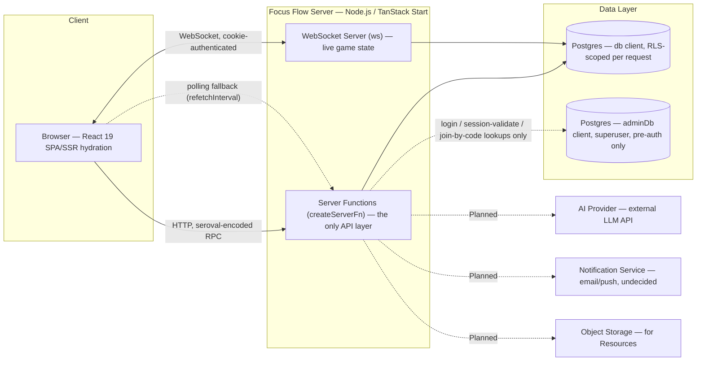

# Focus Flow: System Architecture

*Every service in the actual, running system, and how they talk to each other. This document describes what is really built today, not an idealized target — where something is Planned, it's marked and the real gap that blocks it is named, not glossed over.*

Governed by [-01_Focus_Flow_Principles.md](-01_Focus_Flow_Principles.md). Feeds directly into [09_Database_Design.md] (the schema behind the Data Layer below) and [17_Deployment_Architecture.md] (how this actually gets hosted).

---

## System diagram

*Dashed = either a fallback path or a Planned dependency, not yet built.*

---

## Frontend

**Built.** React 19 inside TanStack Start, with file-based routing via TanStack Router (see [05_Information_Architecture.md](05_Information_Architecture.md) for the routing conventions this imposes). TypeScript throughout, in strict mode. Tailwind v4 + shadcn/ui for components; Framer Motion for interface animation; React Three Fiber, drei, and three.js specifically for the 3D celebration layer (achievement unlocks, quiz/podium moments) — deliberately isolated to that one feature rather than used as a general UI framework, given the real device constraint named in [00_Project_Philosophy.md](00_Project_Philosophy.md) (shared, low-end Android hardware). Forms use react-hook-form with zod resolvers, sharing the exact same zod schemas the server functions validate against — one schema, checked on both sides, never two definitions that can drift apart. TanStack Query owns all server-state caching; Sonner renders toasts.

There is no separate mobile app. The web frontend is the only client, built responsively for the phone-first reality of the actual user base.

---

## Backend

**Built.** There is no separate REST or GraphQL API server — `createServerFn` (TanStack Start's server-function primitive) is the entire backend API surface. Every one of them follows one fixed shape: validate input with a zod schema, resolve the current user, then run the actual work inside `withRlsContext`, which sets a Postgres session variable for that request and lets the database itself — not application code — enforce who can see or touch what.

This has one real, well-known cost worth documenting rather than rediscovering: a server function call does not show up in a network tab under its own name. It appears as an opaque `/_serverFn/<base64>` request, and the response body is seroval-encoded, not flat JSON. Any future debugging tooling, logging, or monitoring integration needs to account for this rather than assume readable endpoint names.

---

## Real-time layer

**Built, with one known production gap.** Live Game Sessions ([F1](04_Product_Requirements_Document.md#f1-live-game-session)) use a raw `ws` `WebSocketServer`, authenticated per connection by parsing the same session cookie the rest of the app uses and re-running the same RLS-equivalent ownership checks (host must own the session; a player must be a real participant) before accepting the connection — a WebSocket is a parallel channel to the HTTP server functions and gets no security for free just because the rest of the app is secure.

If the WebSocket never connects (or isn't running), the same live state is available via TanStack Query polling (`refetchInterval`) against the ordinary server functions — a deliberate fallback, not an afterthought.

**The real gap:** the WebSocket server is currently only started in development mode (`vite.config.ts` gates it on `mode === 'development'`). In an actual production deployment, live games would silently fall back to polling-only unless this is addressed. This is named here, again, so it lands in [17_Deployment_Architecture.md] rather than being rediscovered during a launch.

---

## Database

**Built.** PostgreSQL, accessed through Drizzle ORM, with real Row-Level Security enforced by Postgres itself — not an application-layer check that a future refactor could accidentally bypass. Two distinct clients exist, and the distinction is the single most load-bearing security decision in the system:

- **`db`** — used for almost everything. Every call is wrapped in `withRlsContext(userId, ...)`, which sets `app.user_id` as a Postgres session variable for that transaction; every table's RLS policy checks against it.
- **`adminDb`** — connects as the Postgres superuser and bypasses RLS entirely. Reserved specifically for the handful of operations that inherently need cross-user access *before* a user context can exist: looking a user up by email at login, validating a session token, and the one-time class-code lookup a student needs before they're allowed to enroll (they can't see a class's row via RLS until they're already enrolled in it — a real chicken-and-egg case, not a shortcut).

Two hard-won patterns are permanent architectural rules, not implementation details to relearn later:

1. **Cross-table RLS checks go through `SECURITY DEFINER` Postgres functions, never inline subqueries**, because two tables whose policies each check the other (e.g. Classes checking Enrollments, Enrollments checking Classes) cause Postgres to report infinite recursion. A `SECURITY DEFINER` function runs its internal lookup with the function owner's privileges, breaking the cycle.
2. **A table's own SELECT policy must never re-query that same table by the row's own `id`.** Under `INSERT ... RETURNING`, the row being created isn't visible yet to a nested self-query against the same table within the same command — this fails intermittently and confusingly if not known in advance. The fix is always to check the row's own columns directly, or query a *different* table, never to re-query the table currently being written to.

**Reference data, not enums.** Curricula and subjects (see [B1](04_Product_Requirements_Document.md#b1-curriculum--subject-reference-data)) are real, insertable rows, specifically so a new curriculum is a data-entry task, never a schema migration touching an enum type referenced across the codebase — the concrete mechanism behind Principle 7.

**A drizzle-kit quirk worth preserving:** `drizzle-kit push` silently drops the actual body (`USING`/`WITH CHECK` clauses) of `pgPolicy()` definitions written in schema files — it pushes the *shape* of the policy but not its logic. The real, enforced policy bodies live in a separate script (`apply-rls.ts`) applied directly via `adminDb`, and must be re-run after every schema push. This is not a bug to eventually fix — it's a known limitation of the tool, worked around deliberately.

---

## Authentication

**Built.** Passwords are hashed with `bcryptjs` (a pure-JS bcrypt implementation — confirmed against `package.json`; earlier drafts of this document said "bcrypt," the native package, imprecisely). Sessions are a custom, first-party mechanism — a `session_token` cookie validated against a sessions table — not a third-party auth provider (Supabase Auth, Auth0, Clerk, etc.) and not `auth.uid()`-style RLS, which doesn't exist under this stack. RLS instead reads a per-request Postgres session variable (`app.user_id`) set explicitly at the start of every authenticated transaction, functioning as a deliberately-built equivalent to Supabase's pattern rather than a dependency on it.

`beforeLoad` route guards never call the database or the auth service directly — they call a dedicated server function, because a route's `beforeLoad` runs in a context that can crash the client bundle if it accidentally imports server-only code (cookies, DB clients) directly. This is a real, previously-hit failure mode, not a hypothetical one.

---

## Storage

**Built: none, beyond Postgres itself.** Every piece of data in the product today — including text content like quiz questions and wellness notes — lives in Postgres rows. There is no object/blob storage (no S3-compatible bucket, no CDN for user uploads) anywhere in the system yet.

**This is a real, named blocker**, not a future nice-to-have: the Planned Resource feature ([04_Product_Requirements_Document.md](04_Product_Requirements_Document.md)) — a teacher sharing a file or link with a class — cannot be built at all until an object-storage decision is made. This document does not make that decision; it flags it as a prerequisite for whoever scopes Resource next.

---

## AI

**Planned — nothing built yet.** The architectural shape, when built, is fixed by [02_Product_Definition.md](02_Product_Definition.md)'s AI Philosophy and is not up for reinterpretation at implementation time: a server function calls an external LLM API, the response is stored with an explicit draft/unreviewed status, and it becomes usable (a real quiz question, a sent recommendation) only after a teacher takes an explicit approval action. There is no code path in this architecture where an AI response reaches a student without that approval step existing structurally in between — not as a policy someone has to remember, but as a required state transition the data model itself enforces.

No AI provider has been selected. This is deliberately left open here.

---

## Notifications

**Planned — nothing built yet, and this is a real, currently-unresolved dependency for two other Planned features.** Today, feedback to a user is exclusively in-app and ephemeral (toasts) — there is no email, SMS, or push notification service anywhere in the system. Both the Teacher's private nudge to an at-risk student ([T2](07_User_Journeys.md)) and the Guardian invite flow ([GD1](07_User_Journeys.md)) assumed a delivery channel that does not exist yet. Resolving this (email provider? in-app-only with a badge? SMS, given the real device/data-cost constraints already documented?) is a prerequisite for building either feature, not a detail to fill in during their implementation.

---

## Analytics

**Built, direct-query only — no separate analytics pipeline or third-party telemetry tool.** The Teacher Dashboard ([H1](04_Product_Requirements_Document.md#h1-teacher-dashboard)) and the streak/progress chart both compute their numbers with direct SQL queries against the same operational tables at request time — there is no data warehouse, no batch ETL, and no event-tracking SDK (Segment, Amplitude, PostHog, or similar) integrated anywhere in this codebase today.

**Planned:** Class Trend Analytics ([H2](04_Product_Requirements_Document.md#h2-class-trend-analytics)) extends this same direct-query approach to show trends over time, not a new pipeline.

**A deliberate non-decision:** adopting any third-party analytics/telemetry tool must be evaluated against Principle 6 (Student Wellbeing / data-as-responsibility) *before* adoption, given that the user base is children — this is named here specifically so a future "let's just add PostHog" conversation happens with this document in hand, not as an unexamined default.

---

## How services communicate — summary

| From | To | Protocol | Purpose |
|---|---|---|---|
| Browser | Server Functions | HTTP, seroval-encoded RPC | All reads/writes except live game state |
| Browser | WebSocket Server | WebSocket, cookie-authenticated | Live game state push |
| Browser | Server Functions | HTTP, polled (`refetchInterval`) | Live game state fallback if WS is unavailable |
| Server Functions | `db` (Postgres) | Drizzle, RLS-scoped | Nearly all reads/writes |
| Server Functions | `adminDb` (Postgres) | Drizzle, RLS-bypassing | Login, session validation, join-by-code lookup only |
| WebSocket Server | `db` (Postgres) | Drizzle, RLS-scoped | Reading/broadcasting authoritative game state |
| Server Functions | AI Provider *(Planned)* | HTTPS, external API | Draft quiz/practice content, always teacher-reviewed |
| Server Functions | Notification Service *(Planned)* | TBD | Teacher nudges, Guardian invites |
| Server Functions | Object Storage *(Planned)* | TBD | Resource file/link storage |

---

## Open questions carried into engineering

- Which AI provider, and under what data-handling terms, given the student-data sensitivity established throughout this document set?
- What is the notification delivery channel — email, in-app only, SMS, or a mix — and how does that decision interact with the real data-cost constraints already documented for this market?
- What object storage backend for Resources, and what file-size/type limits given the same low-bandwidth constraint?
- How does the WebSocket server actually get started in a real production deployment, not just `npm run dev`?

---

**Next:** [09_Database_Design.md] — every table, relationship, index, and constraint that makes the RLS model described above actually enforceable.
