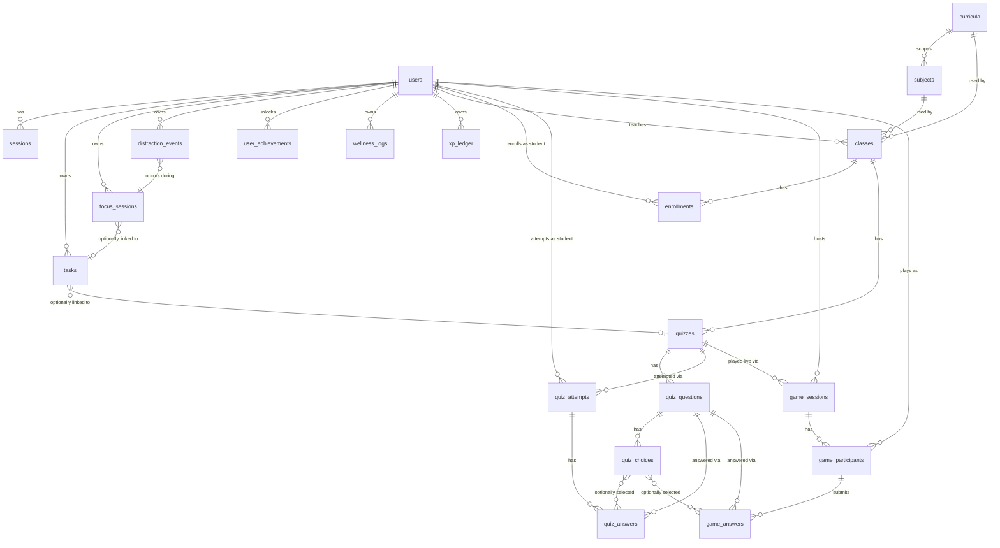

# Focus Flow: Database Design

*Every table, relationship, index, and constraint in the real, live schema — verified by reading the actual schema files and, for the findings below, by testing directly against the running database, not by recollection.*

Governed by [-01_Focus_Flow_Principles.md](-01_Focus_Flow_Principles.md). Implements the model described in [08_System_Architecture.md](08_System_Architecture.md).

---

## ⚠ Critical findings — found and fixed the same session, verified empirically twice

Writing this document surfaced two real, then-live issues in the database, confirmed by direct testing against the running system rather than by reading code alone. **Both were fixed within the same session** (added to `apply-rls.ts`, re-applied via `npm run db:rls`) and independently re-verified via a full 28-check RLS sweep across every table in this schema (see [DESIGN_REVIEW_BOARD.md](DESIGN_REVIEW_BOARD.md)) — this section is deliberately left in, past-tense, as a record of what was found and how, not because the schema is unsound now.

**Correction**: an earlier draft of this section described these as current and unfixed ("not fixed inline... fails today") — that text went stale the moment the fix landed later in the same session and was never updated. [15_Security_Privacy.md](15_Security_Privacy.md), [16_Testing_Strategy.md](16_Testing_Strategy.md), and [18_Product_Roadmap.md](18_Product_Roadmap.md) all correctly described the fix as already done; this section just hadn't caught up to its own history. Worth keeping as an honest example of why [16_Testing_Strategy.md](16_Testing_Strategy.md) recommends a *recurring* review, not a one-time gate — even careful, same-session documentation can drift from the code it describes.

### 1. `xp_ledger` could not be written to through the normal, RLS-scoped path (fixed)

`xp_ledger`'s policy (`xp_ledger_self_access`) was defined with a real `USING`/`WITH CHECK` body directly inside `app/db/schema/xp_ledger.ts` — but per the documented `drizzle-kit push` limitation (see [08_System_Architecture.md](08_System_Architecture.md)), that body is silently dropped on push and never re-applied unless a table is also added to `apply-rls.ts`, the one place real policy bodies actually take effect. `xp_ledger` had never been added. Confirmed at the time directly against the live database: the policy existed with `qual` and `with_check` both `NULL`, and an INSERT through `withRlsContext` failed outright — meaning `app/features/focusMode.ts`'s XP awards (both `startAssignmentFn`'s and the focus-completion handler's) were failing silently.

**Fixed**: added `xp_ledger`'s policy to `apply-rls.ts` and re-ran `npm run db:rls`. Re-verified: an INSERT through `withRlsContext` now succeeds.

### 2. `start_events` and `focus_heartbeats` had Row-Level Security disabled entirely (fixed)

Neither table called `.enableRLS()`. Confirmed at the time: a real user's RLS-scoped session (`withRlsContext`) was able to read another real user's `start_events` row in full, with no restriction whatsoever — a genuine cross-user exposure of exactly the kind of behavioral/assignment engagement data this documentation set treats as sensitive (see [00_Project_Philosophy.md](00_Project_Philosophy.md), [06_User_Roles_And_Permissions.md](06_User_Roles_And_Permissions.md)).

**Fixed**: `.enableRLS()` added to both schema files, self-access policies (`user_id = current app user`) added to `apply-rls.ts`. Re-verified twice: once immediately after the fix, and again in the full cross-table sweep — isolation now holds.

---

## Entity-relationship diagram

*Not shown: `start_events`, `focus_heartbeats` — see below, they have no enforced foreign keys at all, a second, lower-severity finding worth naming here rather than silently omitting.*

---

## Identity

### `users`
| Column | Type | Constraint |
|---|---|---|
| id | uuid | PK |
| email | text | unique, not null |
| password_hash | text | not null |
| first_name, last_name | text | not null |
| role | enum(`student`,`teacher`) | not null, default `student` |
| grade_level | integer | nullable; check: null or 4–12 |
| xp | integer | not null, default 0 |
| status | enum(`active`,`inactive`,`suspended`) | not null, default `active` |
| last_login_at | timestamptz | nullable |
| created_at, updated_at | timestamptz | not null |

**RLS:** `users_self_access` (full access to own row) + `users_class_relation_select` (SELECT-only, via `fn_related_via_class` — lets a teacher and their enrolled students see each other's name, without which nested queries like roster/quiz-result views would crash on a null related user).

**Note:** `users.xp` is a plain integer column, separate from the `xp_ledger` table. The dashboard/progress code path and the ledger are two different sources of XP truth today — reconciling this (should `users.xp` be a cached, derived total, or should it be removed in favor of summing the ledger?) is an open question for [19_Product_Roadmap.md], not resolved here.

### `sessions`
| Column | Type | Constraint |
|---|---|---|
| id | uuid | PK |
| user_id | uuid | FK → users, cascade |
| token | text | unique, not null |
| expires_at | timestamptz | not null |
| created_at | timestamptz | not null |

**RLS:** `sessions_self_access` (full access to own rows only).

---

## Curriculum & Classroom

### `curricula`
| Column | Type | Constraint |
|---|---|---|
| id | uuid | PK |
| code | text | unique, not null |
| name | text | not null |
| country | text | nullable |
| description | text | nullable |
| created_at | timestamptz | not null |

**RLS:** `curricula_select` (world-readable to any authenticated connection). No insert/update/delete policy exists — default-deny; written only by the seed script via `adminDb`.

### `subjects`
| Column | Type | Constraint |
|---|---|---|
| id | uuid | PK |
| curriculum_id | uuid | FK → curricula, restrict |
| name | text | not null |
| code | text | nullable |
| created_at | timestamptz | not null |

**Indexes:** unique (`curriculum_id`, `name`); index on `curriculum_id`.
**RLS:** `subjects_select` (world-readable). Same default-deny write posture as curricula.

### `classes`
| Column | Type | Constraint |
|---|---|---|
| id | uuid | PK |
| name | text | not null |
| code | text | unique, not null |
| teacher_id | uuid | FK → users, cascade |
| status | enum(`active`,`archived`) | not null, default `active` |
| curriculum_id | uuid | FK → curricula, restrict, **not null** |
| subject_id | uuid | FK → subjects, restrict, **not null** |
| grade_label | text | nullable |
| created_at, updated_at | timestamptz | not null |

**Indexes:** `teacher_id`, `curriculum_id`, `subject_id`.
**RLS:** `classes_select` / `classes_insert` (WITH CHECK includes an `EXISTS` against `subjects` enforcing subject↔curriculum consistency at the database layer) / `classes_update` / `classes_delete`, all scoped to `teacher_id = current user`, plus enrolled-student read access.

### `enrollments`
| Column | Type | Constraint |
|---|---|---|
| id | uuid | PK |
| class_id | uuid | FK → classes, cascade |
| student_id | uuid | FK → users, cascade |
| status | enum(`active`,`dropped`) | not null, default `active` |
| enrolled_at | timestamptz | not null |

**Indexes:** unique (`class_id`, `student_id`); index on `student_id`.
**RLS:** `enrollments_select` / `enrollments_insert` / `enrollments_delete`.

---

## Assignment System

### `tasks`
| Column | Type | Constraint |
|---|---|---|
| id | uuid | PK |
| user_id | uuid | FK → users, cascade |
| title | text | not null |
| description | text | nullable |
| priority | enum(`high`,`medium`,`low`) | not null, default `medium` |
| completed | boolean | not null, default false |
| due_date | timestamptz | nullable |
| created_at | timestamptz | not null |
| completed_at | timestamptz | nullable |
| quiz_id | uuid | FK → quizzes, cascade, nullable |
| task_type | enum(`personal`,`practice`,`quiz_assignment`) | not null, default `personal` — Sprint 1 |
| template_id | uuid | FK → task_templates, cascade, nullable — Sprint 1 |
| class_id | uuid | FK → classes, cascade, nullable — Sprint 1 |

**Indexes:** `user_id`, `quiz_id`, `template_id`, `class_id`.
**RLS:** `tasks_self_access` (owner, full access) + `tasks_teacher_select` (a teacher sees rows where `quiz_id is not null and fn_quiz_owned_by_teacher(quiz_id)` **or** `class_id is not null and fn_is_class_teacher(class_id)` — Sprint 1 extended this for Practice Tasks) + **`tasks_teacher_insert_practice`** (Sprint 1, INSERT only).

**A real RLS gap found by testing, not assumed away**: `tasks_self_access`'s `WITH CHECK` requires the inserted row's `user_id` to equal the current session's user — which meant the Practice Task fan-out (a teacher's session inserting rows on behalf of their students) failed outright, confirmed by a direct script reproducing the exact `PostgresError: new row violates row-level security policy for table "tasks"`. Fixed with a second, narrowly-scoped INSERT policy: `withCheck: task_type = 'practice' and class_id is not null and fn_is_class_teacher(class_id)`. Verified it cannot be used to insert a `personal`-typed row for someone else, and cannot be used by a teacher who doesn't own that class.

### `task_templates`
| Column | Type | Constraint |
|---|---|---|
| id | uuid | PK |
| class_id | uuid | FK → classes, cascade |
| teacher_id | uuid | FK → users, cascade |
| title | text | not null |
| description | text | nullable |
| due_date | timestamptz | nullable |
| created_at, updated_at | timestamptz | not null |

**Indexes:** `class_id`, `teacher_id`.
**RLS:** `task_templates_all` (`for: 'all'`, `fn_is_class_teacher(class_id)`) — the owning teacher only; a student never reads a template directly, only their own fanned-out `tasks` row. Deleting a template cascades to every task it fanned out, by design — one delete removes the assignment from every student's list at once.

---

## Focus & Behavior

### `focus_sessions`
| Column | Type | Constraint |
|---|---|---|
| id | uuid | PK |
| user_id | uuid | FK → users, cascade |
| duration_minutes | integer | not null, default 25 |
| started_at | timestamptz | not null |
| completed_at | timestamptz | nullable |
| was_successful | boolean | not null, default false |
| start_event_id | uuid | *(no FK constraint — see gap below)* |
| assignment_id | uuid | *(no FK constraint — see gap below)* |
| verified | boolean | not null, default false |
| task_id | uuid | FK → tasks, **set null** on delete |

**Indexes:** `user_id`, `task_id`, `start_event_id`, `assignment_id`.
**RLS:** `focus_sessions_self_access` (owner) + `focus_sessions_teacher_select` (`task_id is not null and fn_task_is_quiz_owned_by_teacher(task_id)`).
**Planned additions** ([Phase 3 of the redesign roadmap]): `subject_id`, a `source` enum (`pomodoro`/`assignment`) to finally unify this table with the `start_events`/`focus_heartbeats` system below.

### `distraction_events`
| Column | Type | Constraint |
|---|---|---|
| id | uuid | PK |
| user_id | uuid | FK → users, cascade |
| focus_session_id | uuid | FK → focus_sessions, cascade |
| occurred_at | timestamptz | not null |
| duration_seconds | integer | not null; check ≥ 0 |

**Indexes:** `user_id`, `focus_session_id`.
**RLS:** `distraction_events_self_access` (owner only — never teacher-visible, even aggregated at this table; aggregation happens only inside the Risk Signal query, not via a policy grant on this table).

### `start_events`, `focus_heartbeats` — the quiz-assignment engagement system
A second, parallel focus-tracking mechanism (distinct from `focus_sessions`, the Pomodoro-timer table above), backing the assignment-insight / procrastination-signal chain.

**`start_events`**: `id`, `assignment_id` (uuid, no FK), `user_id` (uuid, no FK), `start_at`, `start_method`, `start_xp`, `start_token` (unique), `created_at`, `updated_at`. Unique on (`assignment_id`, `user_id`) and on `start_token`.

**`focus_heartbeats`**: `id`, `focus_session_id` (uuid, no FK), `start_event_id` (uuid, no FK), `assignment_id` (uuid, no FK), `user_id` (uuid, no FK), `heartbeat_at`, `created_at`.

**Both tables now have RLS enabled** (fixed — see Critical Findings above), **but neither has real foreign-key constraints on any of its uuid reference columns** — a separate, still-open data-integrity gap, not fixed alongside the security one. The missing FK constraints mean an `assignment_id` or `start_event_id` referencing a row that no longer exists is not something the database itself would ever catch.

**A second, related gap this document previously missed**: [03_Product_Glossary.md](03_Product_Glossary.md)'s own Assignment entry states plainly that no schema should ever create an untyped "Assignment" reference — say specifically whether a Task or a Quiz is meant. The `assignment_id` column on `start_events`, `focus_heartbeats`, and `focus_sessions` violates this rule directly: it's a bare uuid that polymorphically points at either a Quiz or a Task with no type discriminator and no FK. **Left open, not fixed here** — resolving it properly means deciding the polymorphic-reference pattern (a type-discriminator column? two nullable FKs, one per target? a real Assignment table, which the glossary also warns against?) as part of the Phase 3 focus-system unification, not as an isolated column rename.

**A landmine, not live code:** `app/db/schema/focus.ts` re-declares `startEvents`, `focusSessions`, and `focusHeartbeats` a second time, with an incompatible shape (no RLS, no real foreign keys, different columns) and is never imported from `app/db/schema/index.ts`. It is dead code, confirmed by its absence from the index barrel file — but its mere presence, under the same names, is a real risk that a future edit imports the wrong one by mistake. **Recommended for deletion**, per the already-approved Phase 3 of the redesign roadmap, not a new recommendation invented here.

### `user_achievements`
| Column | Type | Constraint |
|---|---|---|
| id | uuid | PK |
| user_id | uuid | FK → users, cascade |
| achievement_key | text | not null |
| unlocked_at | timestamptz | not null |
| metadata | jsonb | nullable |

**Indexes:** `user_id`; unique (`user_id`, `achievement_key`) — the database itself, not just application logic, guarantees an achievement can never be unlocked twice for the same user.
**RLS:** `user_achievements_self_access` (owner only).

### `wellness_logs`
| Column | Type | Constraint |
|---|---|---|
| id | uuid | PK |
| user_id | uuid | FK → users, cascade |
| mood | integer | not null; check 1–5 |
| notes | text | nullable |
| created_at | timestamptz | not null |

**RLS:** `wellness_logs_self_access` (owner only). The schema file's own comment is explicit about why: *"mood/notes are private mental-health-adjacent data"* — deliberately no teacher-visibility policy exists at all, not even an aggregate one, consistent with [G1](04_Product_Requirements_Document.md#g1-wellness-check-in--reflection).

### `xp_ledger`
| Column | Type | Constraint |
|---|---|---|
| id | uuid | PK |
| user_id | uuid | FK → users, cascade |
| amount | integer | not null |
| source | text | not null |
| metadata | jsonb | nullable |
| created_at | timestamptz | not null |

**RLS:** intended to be `xp_ledger_self_access` (owner only) — **currently non-functional; see Critical Findings above.**

---

## Assessment

### `quizzes`
| Column | Type | Constraint |
|---|---|---|
| id | uuid | PK |
| class_id | uuid | FK → classes, cascade |
| title | text | not null |
| description | text | nullable |
| time_limit_minutes | integer | nullable — per-attempt countdown |
| due_date | timestamptz | nullable — the assignment deadline; setting this is what triggers [C5](04_Product_Requirements_Document.md#c5-quiz-linked-task-auto-creation) |
| is_published | boolean | not null, default false |
| created_at, updated_at | timestamptz | not null |

**RLS:** `quizzes_select` / `_insert` / `_update` / `_delete`, scoped to the owning teacher plus enrolled-student read (published only, or via Live Game participation — see [08_System_Architecture.md](08_System_Architecture.md)'s RLS notes).
**Planned additions** ([F3](04_Product_Requirements_Document.md#f3-public-quiz-bank)): `visibility` enum (`class_private`/`public_bank`), `original_quiz_id` (nullable self-FK, set null on delete, for copy provenance).

### `quiz_questions`
`id`, `quiz_id` (FK → quizzes, cascade), `question_text`, `question_type` (enum `multiple_choice`/`true_false`), `position` (integer, default 0), `points` (integer, default 1). Index on `quiz_id`. RLS mirrors `quizzes`.

### `quiz_choices`
`id`, `question_id` (FK → quiz_questions, cascade), `choice_text`, `is_correct` (boolean), `position`. Index on `question_id`. RLS mirrors `quizzes`. **This is the one table where a leaked `is_correct` value before submission would break the product's core trust invariant** — enforced at the application layer (never included in a pre-submission payload), not by RLS alone, since RLS controls row visibility, not column visibility.

### `quiz_attempts`
`id`, `quiz_id` (FK, cascade), `student_id` (FK → users, cascade), `started_at`, `submitted_at` (nullable), `score` (nullable integer), `max_score` (default 0). Indexes on `quiz_id`, `student_id`. RLS: select/insert/update, scoped to the student's own attempts plus the owning teacher's read access (via `fn_attempt_visible_to_teacher`).

### `quiz_answers`
`id`, `attempt_id` (FK → quiz_attempts, cascade), `question_id` (FK → quiz_questions, cascade), `selected_choice_id` (FK → quiz_choices, **set null** on delete), `is_correct` (nullable boolean). Index on `attempt_id`.

---

## Social & Live Play

### `game_sessions`
`id`, `quiz_id` (FK → quizzes, cascade), `host_id` (FK → users, cascade), `pin` (unique text), `status` (enum `lobby`/`question`/`reveal`/`finished`, default `lobby`), `current_question_index` (default 0), `question_duration_seconds` (default 20), `phase_started_at`, `created_at`, `ended_at` (nullable). Index on `quiz_id`.

**RLS:** `game_sessions_select` uses `fn_quiz_owned_by_teacher(quiz_id) OR fn_is_game_participant(id)` — checking the row's own `quiz_id` column directly rather than self-referentially re-querying `game_sessions` by its own `id`, which is the specific pattern that avoids the `INSERT ... RETURNING` self-reference failure documented in [08_System_Architecture.md](08_System_Architecture.md).

### `game_participants`
`id`, `session_id` (FK → game_sessions, cascade), `student_id` (FK → users, cascade), `nickname`, `score` (default 0), `joined_at`. Unique on (`session_id`, `student_id`) — a student can join a given session exactly once.

### `game_answers`
`id`, `participant_id` (FK → game_participants, cascade), `question_id` (FK → quiz_questions, cascade), `selected_choice_id` (FK → quiz_choices, set null), `is_correct` (not null), `points_awarded` (default 0), `response_time_ms` (not null), `answered_at`. Unique on (`participant_id`, `question_id`) — one answer per question per participant, enforced by the database, not just by client-side "already answered" logic.

---

## Constraints & integrity patterns, summarized

- **Cascade vs. restrict is deliberate, not default.** Deleting a user cascades through everything they own (tasks, sessions, attempts, etc.) — a full account deletion genuinely removes all associated data, which matters for the right-to-erasure capability named for Platform Administrator in [06_User_Roles_And_Permissions.md](06_User_Roles_And_Permissions.md). Deleting a curriculum or subject is **restricted** (blocked) if any class still references it — reference data can't be pulled out from under live classes by accident.
- **Uniqueness is enforced at the database, not just checked in a form**: class codes, game PINs, session tokens, (user, achievement) pairs, (session, student) pairs, (participant, question) pairs — every one of these has a real unique index, not just an application-level check.
- **Check constraints hold data honest at the source**: mood is 1–5, distraction duration is non-negative, grade level is null-or-4-to-12 — invalid data can't reach the database even from a buggy or malicious client.
- **The `xp_ledger` and `start_events`/`focus_heartbeats` findings above are the only known deviations from this otherwise-consistent integrity model** — which is exactly why they're flagged prominently rather than left to be discovered later.

---

## Open questions carried into engineering

- Reconcile `users.xp` (a plain counter) against `xp_ledger` (an append-only log) — pick one source of truth, per the note under `users` above.
- **Resolve the polymorphic `assignment_id` pattern** (violates [03_Product_Glossary.md](03_Product_Glossary.md)'s own naming rule) as part of the Phase 3 unification — decide the real reference shape (type-discriminator column, two nullable FKs, or otherwise) and add the missing foreign-key constraints at the same time.
- Confirm whether `app/db/schema/focus.ts` truly has zero remaining references anywhere before deleting it (re-verify at deletion time, don't assume this document's confirmation is still current).

---

**Next:** [10_API_Architecture.md] — every server function, its input/output contract, and how it maps onto the tables and RLS rules described here.
