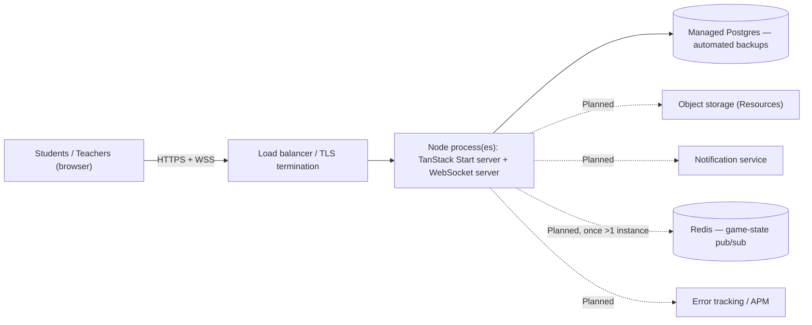

# Focus Flow: Deployment Architecture

*Originally written when there was no deployment configuration anywhere in this repository. A production entry now exists (`server/prod.ts`) and is confirmed live on Railway — see §4 for what changed and a real bug it surfaced along the way. Still genuinely untested: real classroom-scale usage, and everything named as a launch prerequisite in Version 1.0 of [18_Product_Roadmap.md](18_Product_Roadmap.md) (legal review, backups, monitoring) — a working deploy is not the same claim as "ready for a real school."*

Governed by [-01_Focus_Flow_Principles.md](-01_Focus_Flow_Principles.md). Resolves the dependencies deliberately deferred here by [08_System_Architecture.md](08_System_Architecture.md) (the WebSocket production gap) and [15_Security_Privacy.md](15_Security_Privacy.md) (backups, recovery, encryption in transit/at rest).

---

## 1. Development (real, today)

`npm run dev` starts a single Vite dev server; Postgres runs locally (`DATABASE_URL`/`DATABASE_ADMIN_URL` both point at `localhost:5432`); the WebSocket server for Live Game Sessions starts only because `vite.config.ts` gates it on `mode === 'development'` — which is precisely why it doesn't yet run anywhere else. This is the entire real infrastructure that exists today.

---

## 2. The one hard constraint that shapes every option below

**Focus Flow cannot be deployed to a plain serverless-functions host (a bare Vercel/Netlify Functions deployment, for instance) without breaking Live Game Sessions.** The raw `ws` `WebSocketServer` ([08_System_Architecture.md](08_System_Architecture.md)) needs a long-running, persistent Node process to hold open connections — a serverless function that spins up per-request and tears down has no way to do this. The existing polling fallback would silently become the *only* path in that scenario, not a backup for an edge case, but the entire live-game experience degrading to a 1200ms-latency poll for every game, permanently, with no visible warning that it happened. **Any hosting decision must be evaluated against this constraint first**, before cost or familiarity.

Platforms that satisfy this constraint: a platform-as-a-service supporting a persistent Node process (Railway, Render, Fly.io), or a conventional VPS. Cost-sensitivity is itself a named business risk in [01_Product_Vision.md](01_Product_Vision.md) — a managed platform-as-a-service is likely the right fit for a solo/small team over raw cloud infrastructure (AWS/GCP directly), which trades lower cost for real DevOps effort this team doesn't yet have the capacity for.

**Decided**: Railway, chosen for setup simplicity over Render/Fly.io (Nixpacks auto-detection, one-click managed Postgres, generous free tier) — not a claim that it's the only valid choice, just the one made. This followed an earlier, real attempt to deploy to a bare Vercel serverless target, which produced a `404 NOT_FOUND` — Vercel's build-output convention doesn't match a fetch-handler-shaped Node app without an adapter, and even with one, it would have hit exactly the WebSocket constraint above. Switching host, not patching around it, was the correct call.

---

## 3. Testing (in CI — not yet built)

Per [16_Testing_Strategy.md](16_Testing_Strategy.md), a real CI pipeline doesn't exist yet. When built, the proposed order matches that document's own prioritization: type-check (`tsc -b`) → lint (`oxlint`) → the RLS cross-user-isolation security suite (§6 of that document, once formalized) → unit tests (once Vitest is adopted) → Playwright E2E → build. Gating a merge on all of these vs. running some only informationally is an open decision, not resolved here.

---

## 4. Production

**Built and confirmed live on Railway.** The Postgres role's password was rotated away from `bootstrap-role.ts`'s hardcoded dev-only default (`'password'`) before this database was ever treated as real — that script is correct for a disposable local dev instance, wrong for one holding anything real, and this is the first time it's been run against the latter. One Node process (`server/prod.ts`) running the TanStack Start SSR handler, static asset serving for `dist/client`, and the game WebSocket server, all on one `http.Server` and one port (`process.env.PORT`) — no second exposed port needed, unlike the original standalone-port-3001 dev setup. `attachGameWebSocketServer()` ([08_System_Architecture.md](08_System_Architecture.md)) mounts the socket on the same server via a path-filtered `'upgrade'` handler (`/ws/game`) rather than binding its own port, specifically so this works behind Railway's single-domain HTTPS proxy with no extra TCP-proxy configuration.

**A real, separate bug found while building this, unrelated to hosting**: the production build was silently broken regardless of host. `vite.config.ts` merged `.env`'s `NODE_ENV=development` (kept there for local dev convenience) into `process.env` even during `vite build`, and separately, an ambient empty-string shell `NODE_ENV` survived Vite's own "set if absent" default — either way, `@vitejs/plugin-react` picked the dev JSX transform (`jsxDEV`) even in a production build. The built `server.js` then threw `TypeError: jsxDEV is not a function` on its first real render, since `react-dom`'s production SSR entry has no such export. Fixed by having `vite.config.ts` force `process.env.NODE_ENV` to match Vite's own build/dev mode explicitly, before anything else reads it. This means **every prior build of this app, had one ever been produced, would have crashed identically** — not something this deployment attempt introduced, just the first time anyone tried to actually run a production build and found out.

`NODE_ENV=production` and real `DATABASE_URL`/`DATABASE_ADMIN_URL` values pointing at the managed Postgres instance, never `localhost`, are still the deploy-time requirement — Railway sets `PORT` and (once configured) `NODE_ENV` automatically; `DATABASE_URL`/`DATABASE_ADMIN_URL` must be set manually to the managed Postgres instance's connection strings.

**Encryption in transit**, deferred from [15_Security_Privacy.md](15_Security_Privacy.md): resolved by whichever host is chosen terminating TLS in front of the app — this is a hosting-platform default on every reasonable option named in §2, not custom work, but it must be explicitly verified once a host is chosen, not assumed.

**Encryption at rest**, same deferral: whatever the managed Postgres provider offers by default — a real selection criterion when choosing a provider, not an afterthought once one is already picked.

---

## 5. CI/CD

**Does not exist today.** GitHub Actions is the natural default (no evidence of any other CI system anywhere in this repo, and the project is plausibly already on GitHub given its structure) — not confirmed, but the obvious starting assumption. Proposed pipeline, restated from §3 with the deploy step added: on every push to main, run the full test sequence, and on success, deploy to the chosen host (§2) automatically. Whether staging exists as a separate environment before production, or the pipeline deploys directly, is an open decision.

---

## 6. Monitoring

**None exists.** No error-tracking or APM tool (Sentry or similar) appears anywhere in `package.json` — confirmed by checking, not assumed absent. **A real, concrete gap once this product has real users**: today, if a production request fails, nothing surfaces that failure anywhere except the end user's own toast notification (per [11_UI_UX_Design_System.md](11_UI_UX_Design_System.md)) — no one operating the product would ever know unless a user reported it directly. Recommended for the same reason [08_System_Architecture.md](08_System_Architecture.md) flagged third-party analytics: any tool chosen here should be evaluated against Principle 6 first, since error reports from a children's-data product can easily capture more sensitive detail than intended if not configured carefully (e.g., scrubbing wellness-log content or personal task titles out of error payloads before they ever reach a third-party error-tracking service).

## 7. Logging

**None exists beyond ad hoc `console.log`.** No structured, centralized logging. A real prerequisite specifically for [15_Security_Privacy.md](15_Security_Privacy.md) §4's audit-log requirement — that section needs its own dedicated `audit_log` table, but *operational* logging (request-level, error-level) is a separate, also-currently-missing capability this document names as its own gap, not solved by the audit table alone.

---

## 8. Scaling

**A real, concrete architectural constraint, not yet solved**: the rest of the application is stateless (every server function reads/writes Postgres, holds no state in process memory) and would scale horizontally without issue behind a load balancer. **The WebSocket layer is the one genuine exception.** `broadcastGameState()` ([08_System_Architecture.md](08_System_Architecture.md), [10_API_Architecture.md](10_API_Architecture.md)) almost certainly holds live game state and connections in a single process's memory today — if Focus Flow ever runs more than one server instance behind a load balancer, a player connected to instance A would never receive a broadcast triggered by a teacher's action processed on instance B. **This needs a shared pub/sub layer (Redis is the conventional choice) before horizontal scaling of the WebSocket layer is possible** — named here as a concrete, specific prerequisite, not a vague "scaling will need work eventually."

Given the realistic near-term user base (per [01_Product_Vision.md](01_Product_Vision.md)'s sequencing — one school, then a handful of schools, before any broader rollout), a single well-resourced instance is very likely sufficient for some time; this section exists so the Redis requirement is known *before* it's urgently needed, not discovered mid-incident during a real school's exam-week traffic spike.

---

## 9. Cloud architecture (target)

---

## 10. Disaster recovery

**Does not exist today.** Deferred from [15_Security_Privacy.md](15_Security_Privacy.md) §8–9, resolved here as a concrete target rather than left abstract: automated daily Postgres backups with point-in-time recovery (a standard offering on any managed provider satisfying §2), plus a periodically-*tested* restore procedure — a backup that has never been restored from is not a verified backup, only an assumption of one. This is named as a real launch requirement for handling a real school's data, not a nice-to-have to add after an incident proves it was needed.

---

## Open questions carried into engineering

- ~~Final hosting platform decision (§2)~~ — **resolved: Railway**, confirmed live (§4).
- Whether CI (§3, §5) gates merges or runs informationally at first.
- Which error-tracking/monitoring tool (§6), evaluated against the same privacy-review requirement already named for analytics tools in [08_System_Architecture.md](08_System_Architecture.md).
- When (not if) Redis-backed pub/sub (§8) becomes necessary — tied to real usage growth, not a fixed date.
- Confirm the chosen host's actual TLS and at-rest encryption defaults once one is selected (§4) — not assumed from this document alone.

---

**Next:** [18_Product_Roadmap.md] — sequencing every Planned item across this entire eighteen-document set (and the already-approved six-phase redesign plan) into an actual, ordered release plan.
